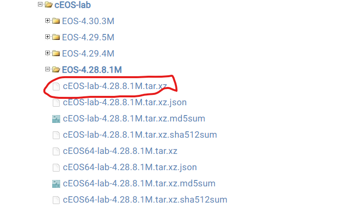
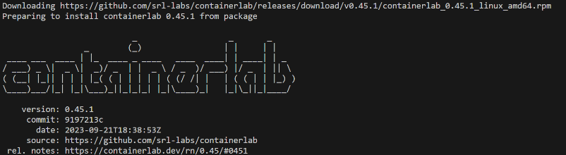
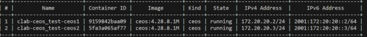
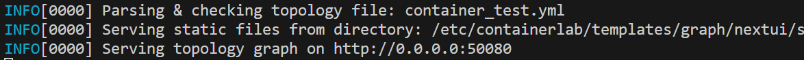
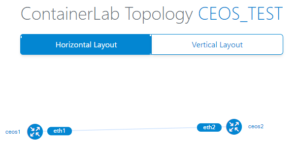

# はじめに
こんにちは、iTOC事業部の北村です。  
皆様、仮想的な検証環境を作ろうとする際に、どのような基盤を利用するか悩まれることはないですか？  
または、少し試してみたいことがあるけど、一から検証環境を作るのを面倒に感じたりすることはないですか。  
この記事では、containerlabを使ったArista検証機の立ち上げから、Ansibleでの設定変更を試してみたので紹介したいと思います。


# containerlabとは
・コンテナベースのネットワークラボを構築してくれるOSS  
・環境をyml形式で定義するので簡単で流用もしやすい  
・パケットキャプチャやトポロジー図作成もできる  
・マルチベンダーに対応している  
・環境の構築、削除が1コマンドで実行できる  


# 事前準備

・Ansibleが実行できる環境の用意  
・containerlabを実行するための環境準備  
(一部のOSは1VMにつき2vCPUを使用、今回は4vCPU必要なためAWSのec2インスタンスでt2.xlargeを選択しています)  
・Dockerインストール  
・以下のURLからeosのイメージをダウンロード(アカウント登録必要)
https://www.arista.com/en/support/software-download

・Arista アカウント登録  
*アカウントがない場合はneed a user accountより作成する


・ログイン後にsoftware downloadからイメージをダウンロード



# containerlabインストール

```
sudo bash -c "$(curl -sL https://get.containerlab.dev/)"
```
無事インストールできました。


### ・イメージのimport
適当なディレクトリを作成して先ほどダウンロードした、eosのイメージファイルを格納しておきます。  
その後下記のコマンドで、imageをインポートします。
```
sudo docker import cEOS-lab-4.28.8.1M.tar ceos:4.28.8.1M
```


### ・containerlabで実行したい環境をymlファイルで記述

今回は2台の機器を接続状態で立ち上げて、外部からsshで入れるようにポートフォワーディングしています。

```
---
name: ceos_test

topology:
  nodes:
    ceos1:
      kind: ceos
      image: ceos:4.28.8.1M
      ports:
        - 2222:22
    ceos2:
        kind: ceos
        image: ceos:4.28.8.1M
      ports:
        - 2223:22

  links:
    - endpoints: ["ceos1:eth1", "ceos2:eth2"]
```

# containerlab 起動

### ・起動
statusがrunningになっており、起動していることが確認できたのでトポロジー図を確認してみます。

```
sudo containerlab deploy -t ファイル名.yml
```




### ・トポロジー図確認

```
sudo containerlab graph -t (containerlab起動ymlファイル)
```

表示されたURLをクリック



無事表示されました！

# Ansible実行環境からcontanerlabにssh

EC2→セキュリティ→セキュリティグループ→インバウンドルールの編集


インバウンドルールに  
タイプ:　カスタムTCP  
ポート範囲:2222-2223  
ソース: ansible実行環境のIP 

containerlabで立ち上げた機器のshow routeを見てみる

```
---
- hosts: eos
  gather_facts: false

  tasks:
    - name: show version
      arista.eos.eos_command:
        commands: 
          - command: show version
      register: result

    - name: Debug show
      ansible.builtin.debug:
        msg: "{{ result.stdout_lines[0] }}"
```

無事Ansibleの実行環境からcontainerlabで立ち上げた環境のshow versionを見ることができました！

```
PLAY [eos] ******************************************************************************************************************************************

TASK [show version] *********************************************************************************************************************************
ok: [ceos02]
ok: [ceos01]

TASK [Debug show] ***********************************************************************************************************************************
ok: [ceos01] => {
    "msg": [
        "Arista cEOSLab",
        "Hardware version: ",
        "Serial number: C176FE288E152E5E5664D77832C446BE",
        "Hardware MAC address: 001c.73ee.f229",
        "System MAC address: 001c.73ee.f229",
        "",
        "Software image version: 4.28.8.1M-32996684.42881M (engineering build)",
        "Architecture: i686",
        "Internal build version: 4.28.8.1M-32996684.42881M",
        "Internal build ID: 747d90a4-e0fb-465d-ba68-4a63d8baf0be",
        "Image format version: 1.0",
        "Image optimization: None",
        "",
        "cEOS tools version: 1.1",
        "Kernel version: 6.1.49-70.116.amzn2023.x86_64",
        "",
        "Uptime: 4 minutes",
        "Total memory: 16365748 kB",
        "Free memory: 13624384 kB"
    ]
}
ok: [ceos02] => {
    "msg": [
        "Arista cEOSLab",
        "Hardware version: ",
        "Serial number: 0C4001D8BA125051E6FADB3C4B4F5430",
        "Hardware MAC address: 001c.7311.48ba",
        "System MAC address: 001c.7311.48ba",
        "",
        "Software image version: 4.28.8.1M-32996684.42881M (engineering build)",
        "Architecture: i686",
        "Internal build version: 4.28.8.1M-32996684.42881M",
        "Internal build ID: 747d90a4-e0fb-465d-ba68-4a63d8baf0be",
        "Image format version: 1.0",
        "Image optimization: None",
        "",
        "cEOS tools version: 1.1",
        "Kernel version: 6.1.49-70.116.amzn2023.x86_64",
        "",
        "Uptime: 4 minutes",
        "Total memory: 16365748 kB",
        "Free memory: 13624384 kB"
    ]
}

PLAY RECAP ******************************************************************************************************************************************
ceos01                     : ok=2    changed=0    unreachable=0    failed=0    skipped=0    rescued=0    ignored=0   
ceos02                     : ok=2    changed=0    unreachable=0    failed=0    skipped=0    rescued=0    ignored=0   
```

# 終わりに

実際にcontainerlabに触れてみて、以下のことを感じました。
- containerlabで検証環境を立ち上げるまでのプロセスが簡単
- 一度定義ファイルを作成してしまえば、検証環境を消したり、作り直すことが簡単。  
- 作業者間で定義ファイルを共有して、それぞれの環境で同一の検証環境を簡単に作成できる
- 少ないリソースで動かせる
- マルチベンダーに対応しているが、ベンダーによってはイメージを手に入れるのが難しい場合もある。  

今後、仮想検証環境を作成する際の選択肢の一つにしていただけると幸いです。


