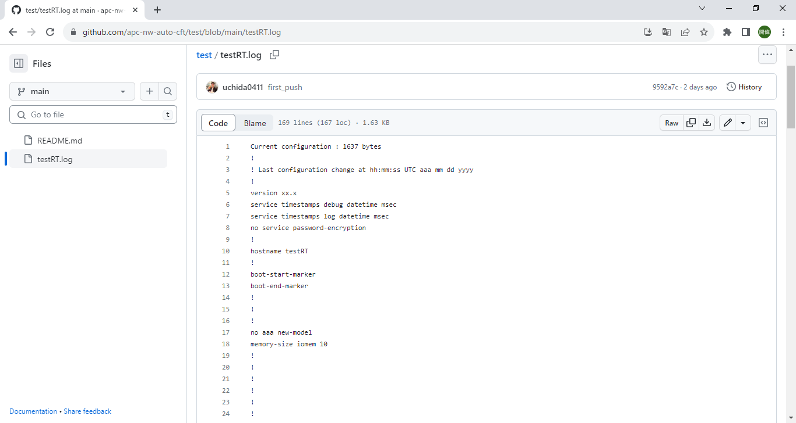
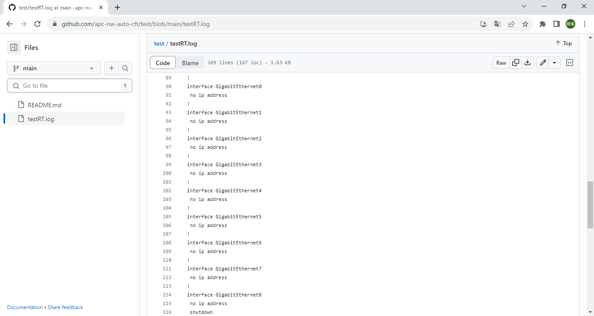
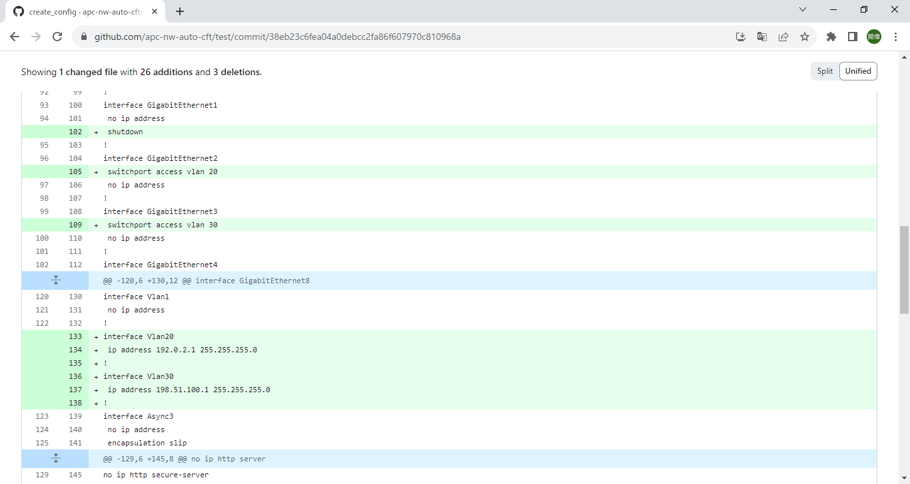
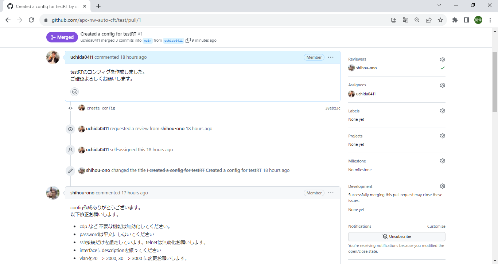
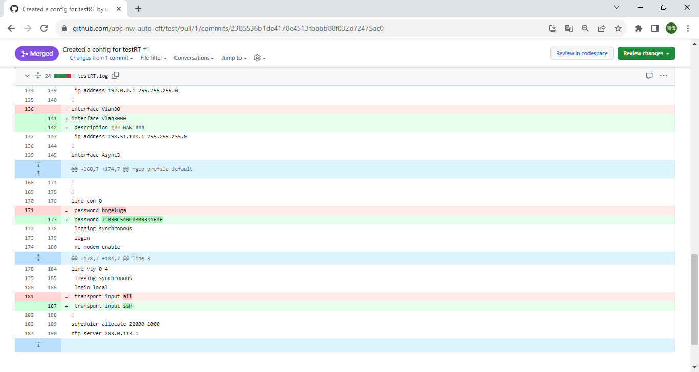
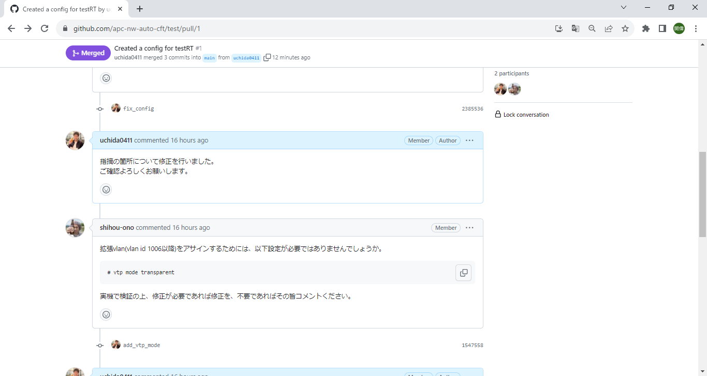
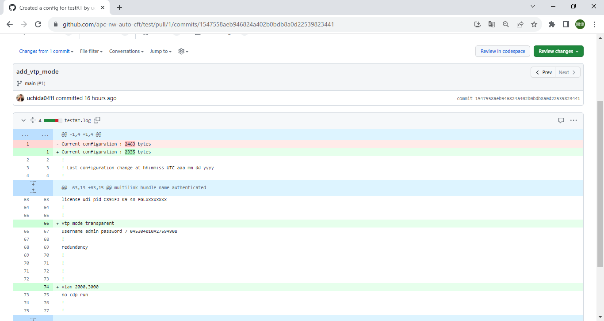
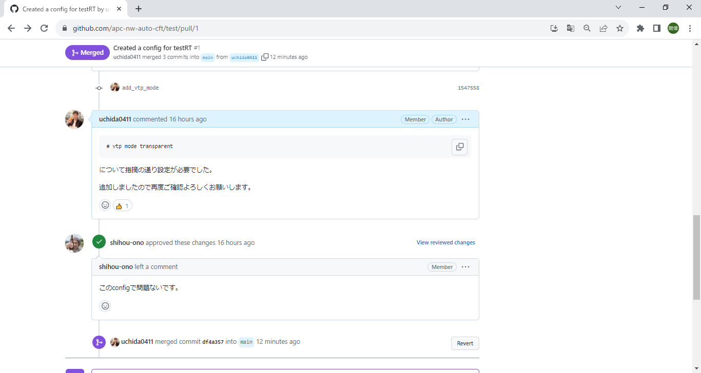
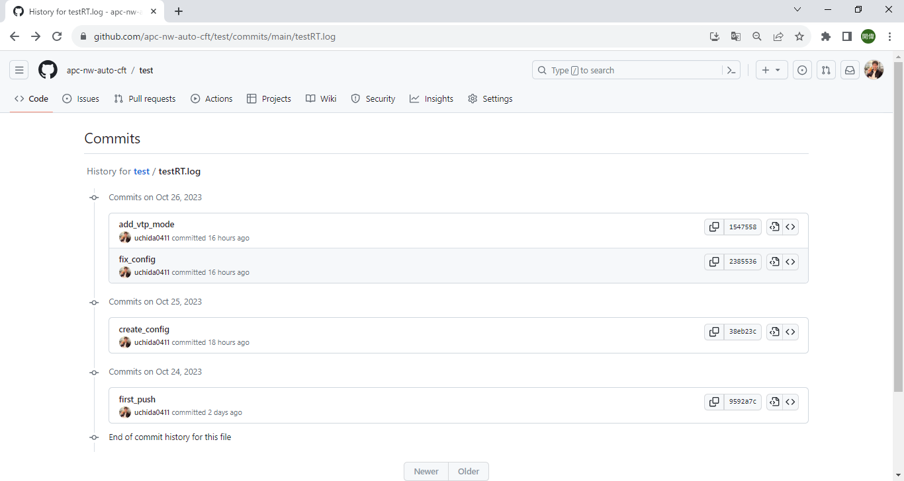

# 【Blog Week】Gitを用いたコンフィグ管理のすゝめ

## はじめに

初めましてiTOC事業部BzD部の内田です。  
皆さんはネットワーク機器のコンフィグを管理する際に以下のような困りごとは無いでしょうか？

* 「いつ」「誰が」「なぜ」「どんな」変更を加えたのか分からない
* 複数人で更新していたためにデグレードが発生してしまった
* 差し込みの業務に忙殺されていたらレビューの指摘事項を忘れてしまった

上記の解消として「Git」を用いてみるのはいかがでしょうか？

## Gitって何？

そもそも「Git」とは何者なのかですが、『ファイルを世代管理するためのツール』で、  
主にプログラマがコードを書く際に用いられており、メリットとしては以下などがあります。

* 同一ファイル名で世代管理でき、更新内容を追ったり過去バージョン戻したりするのが楽になる
* ファイルが占有されないため、複数人で並行した作業が楽になる
* 「関連サービス(※1)」を用いることで、ファイルに関連したコミュニケーションを残すことが楽になる

## GitHubって何？

別途Gitと併せて名前を聞く「GitHub」ですが上記で記載した「関連サービス(※1)」にあたるもので、  
各自で作成したファイルを統合管理して"よりGitを利用しやすくするもの"となります。

## 具体的にどんなイメージ？

今回、例としてCiscoルータのコンフィグを  
GitHubを用いてメンバ、リーダで検討していく風にシミュレートします。  

最初に初期コンフィグを用意します。

その後コンフィグを編集しリーダにレビューを依頼します。

レビュー結果として指摘事項があったため該当箇所の修正を行い再レビューを依頼します。

更に指摘事項がある場合は、上記までの流れを繰り返しコンフィグを仕上げていきます。  

各修正内容について「いつ」「誰が」「どんな」が世代管理されていき、  
必要に応じて以前のバージョンに戻ることができます。

## おわりに

Gitを用いたコンフィグ世代管理についてイメージできましたでしょうか？  

「いつ」「誰が」「なぜ」「どんな」が可視化されることによって、  
コミュニケーションの負担が減り、本質的な業務へリソースを振り向けるきっかけに繋がると考えられます。

ご興味を持たれましたら、ぜひ管理方法の変更について検討してみてください！  
(どのようにすれば構築できるかについても今後記載できればと思います。)
