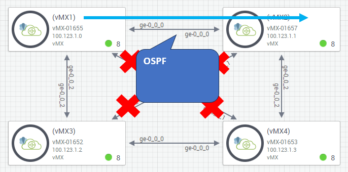
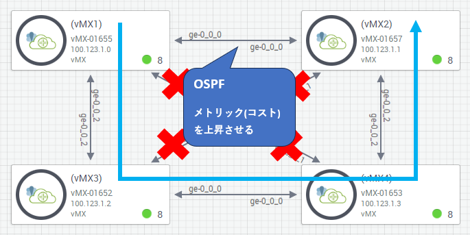
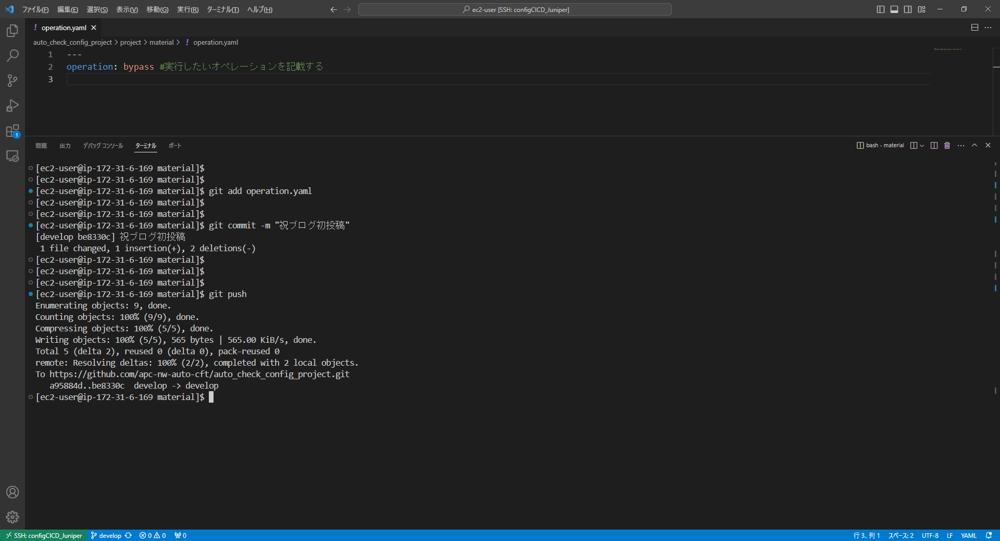
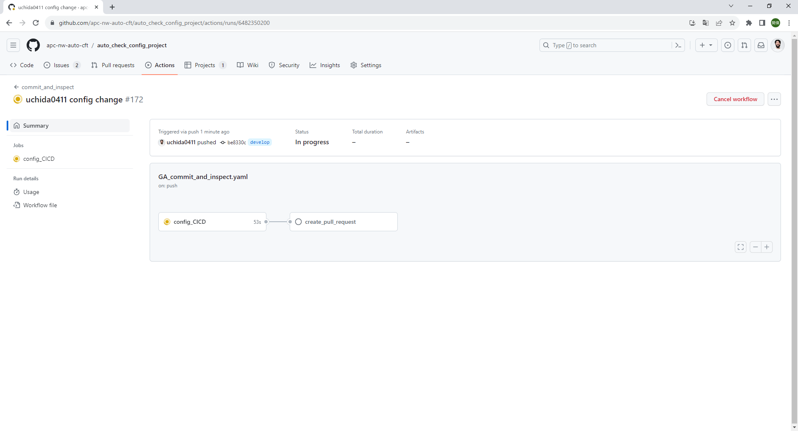
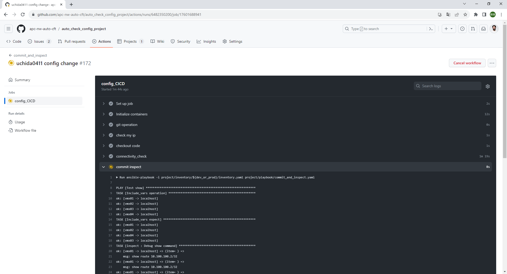
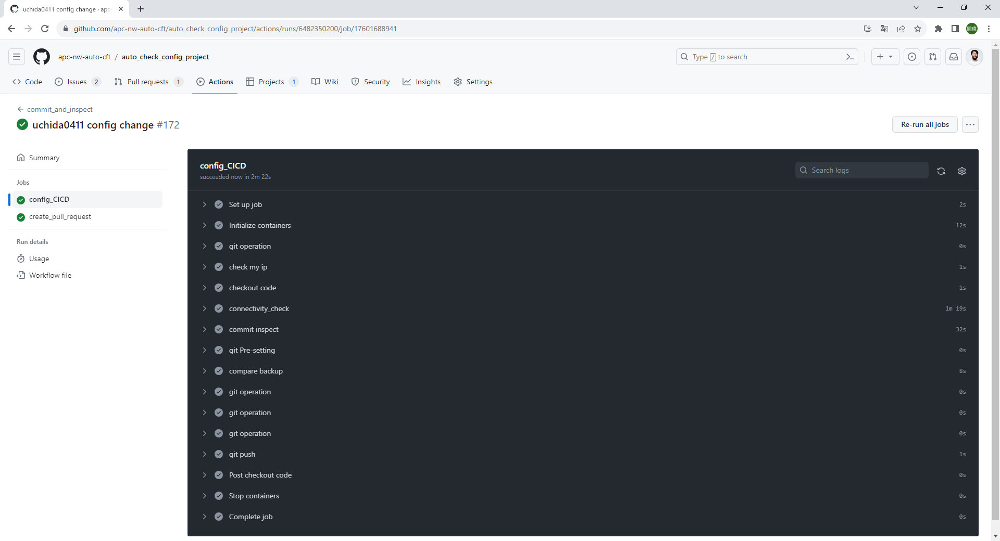
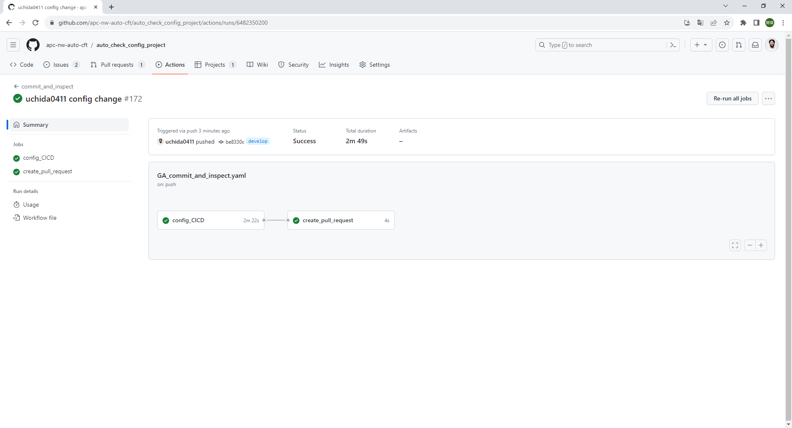
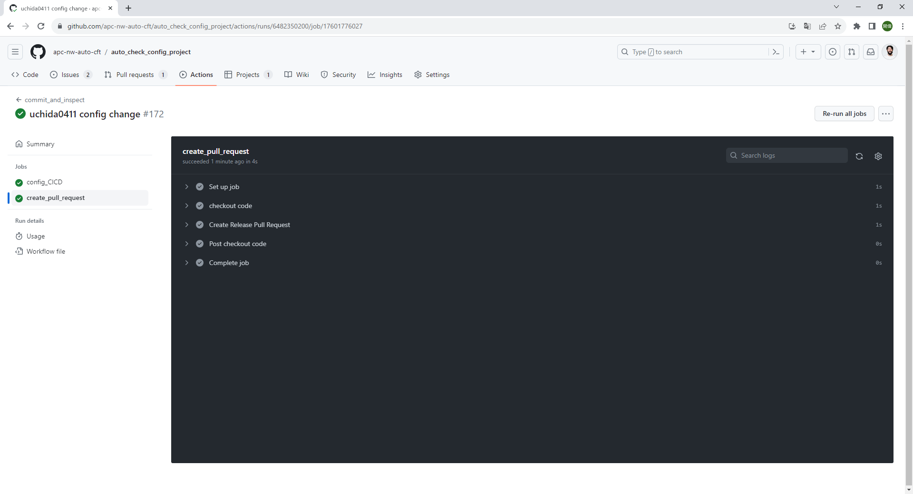
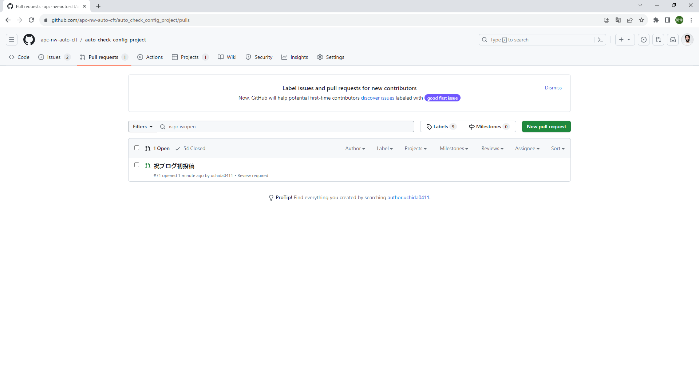

# 【Blog Week】ネットワーク機器をCICDツールで設定してみた

xxx事業部xxxの内田です。  
皆さんは普段どんな方法でネットワーク機器を設定しているでしょうか？

* コンソールやSSH/Telnetなどから手動で
* Tera Termマクロなど簡易的なプログラムを使って
* Cisco Merakiなど管理コントローラ経由で  
etc...

私が所属しているxxx部xxxでは  
主に構成管理ツールである「Ansible」を用いて  
お客様の業務効率化の支援をさせていただいております。  
[URLを貼る]

？？？接続詞？？？今回はCICDツールである  
「GitHub Actions」を用いたネットワーク機器への作業について  
どのようなものか紹介したいと思います。

## そもそもCICDツールって何？
前提としてネットワークエンジニアの皆さんは  
CICDツール自体がなじみの無いものではないかと思います。

CICDツールとは～～～  
⇒書きっぷりを検討

## 従来の設定方法と比べて何が便利になる？

～～～  
⇒書きっぷりを検討

## 構成/作業シナリオ紹介
それでは今回どのような作業を行うか紹介したいと思います。  

構成として以下画像のようにJuniperのサンドボックス環境に  
vMXルータ(仮想MXルータ)を4台用意しました。  
通常だとvMX1からvMX2への通信は「ge-0_0_0」を経由します。  

そのうえで「ge-0_0_0」のOSPFのメトリック(コスト)を上昇させることで、  
vMX1からvMX2への通信が「ge-0_0_2」を経由するよう設定変更したいと思います。  

## 動作イメージ
では実際に動作させてみようと思います。

⇒必要な画像だけに絞る(倍率が高くて文字が見づらい？)  
⇒各断面での説明文を記載する  

## 終わりに
CICDツールを用いたネットワーク機器の設定変更についてイメージがついたでしょうか？

別途今回動作させた環境では以下の観点があり、それぞれ記事にする予定ですのでご期待ください  
* 想定値と現状の比較(Assert)  
[URLを貼る]

* コンフィグ世代管理(Git)  
[URLを貼る]
