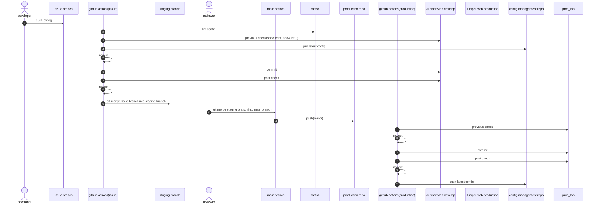
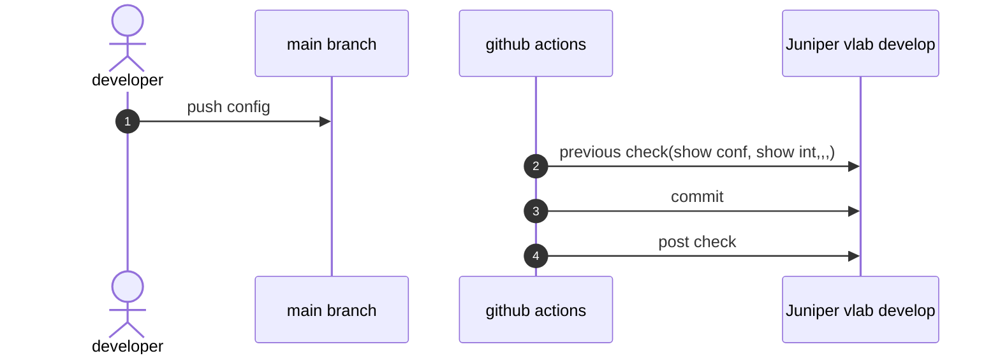

# flow

## 完成形

```mermaid
sequenceDiagram
  autonumber
  actor developer
  participant ib as issue branch
  participant issue_ac as github actions(issue)
  participant sb as staging branch
  actor reviewer
  participant mb as main branch
  participant bf as batfish
  participant prod_repo as production repo
  participant prod_repo_ac as github actions(production)
  participant devlab as Juniper vlab develop
  participant prolab as Juniper vlab production
  participant config_repo as config management repo
  developer->>ib: push config
  issue_ac->>bf: lint config
  issue_ac->>devlab: previous check(show conf, show int,,,)
  issue_ac->>config_repo: pull latest config
  issue_ac->>issue_ac: inspect
  issue_ac->>devlab: commit
  issue_ac->>devlab: post check
  issue_ac->>issue_ac: inspect
  issue_ac->>sb: git merge issue branch into staging branch
  reviewer->>mb: git merge staging branch into main branch
  mb->>prod_repo: push(mirror)
  prod_repo_ac->>prod_lab: previous check
  prod_repo_ac->>prod_repo_ac: inspect
  prod_repo_ac->>prod_lab: commit
  prod_repo_ac->>prod_lab: post check
  prod_repo_ac->>prod_repo_ac: inspect
  prod_repo_ac->>config_repo: push latest config

```

## phase01

```mermaid
sequenceDiagram
  autonumber
  actor developer
  participant mb as main branch
  participant ac as github actions
  participant devlab as Juniper vlab develop
  developer->>mb: push config
  ac->>devlab: previous check(show conf, show int,,,)
  ac->>devlab: commit
  ac->>devlab: post check

```
