# configCICD Group 中間成果発表 2023/07/27

## アジェンダ

* 参加メンバ紹介

* 参加の経緯

* GitHub や GitHub Actionsって？

* やりたいこと

* 今回のDemoで設定する内容

* ツール実演

* どのように実現しているか？

* 工夫した点

* 下期の展望

* 所感

* 質疑応答

 
 
 

## 参加メンバ紹介

### 小野

* MBS ATNW所属
* NW自動化横串チームのリーダ
* 自動化のモチベーションは、ヒューマンエラーヒューマンだから

### 内田

* BzD ACT所属
* NWの運用/保守2年、設計/構築4年
* 2023/4からACTに異動（開発1年生）

### 北村

* CWE MAISP所属
* NWの運用/保守2年弱
* 予備知識ほぼなし(横串のAnsibleトレーニングのみ)

 
 
 

## 参加の経緯

### 小野

NW機器のConfigもCICDの流れに乗せられたら、NWエンジニアも興味を持ってくれるかな、というモチベーションがスタート。  
configを各機器に自動で投入してくれたら、検証楽になるよなーとか、  
想定と実状態の差異がないことを機械的に取得できれば、会議なしにレビュアーの1clickで済まないかなー  
とか、そういう夢を詰め込みました。

### 内田

2022年に取り組んでいたSmartCSを題材とした自動化が、  
実行途中でのSSHとコンソール接続の切り替えなど出来る部分は作成しきってしまった。  
ACTやMBS内でのヒアリングを通してCICDのアイデアを得たため参加

### 北村

小野さんから取り組みを紹介され興味を持った。  
幅広い技術に触れることができ、前提知識もそこまで必要ないとのことで途中から合流

 
 
 

## GitHub や GitHub Actionsって？

*ビルド、テスト、デプロイのパイプラインを自動化できる継続的インテグレーションと継続的デリバリー (CI/CD) のプラットフォーム*

**この字面だけでは、NWの世界に活かせる予感が全くしない！**

### GitHub

* プログラムのソースコードを、オンラインで共有・管理するサービス
* プログラマだけが使うものと思われがちだが、テキストで書かれた文書管理全般に使える
  * つまり、NWエンジニアも手順書だったり、コンフィグ管理等で使える！

業務でonline上に成果物を置くのを避けたかったら、オンプレのサーバにinstallして使える[Gitlab](https://about.gitlab.com/install/)もあります。

### GitHub Actions

* 特定の操作をトリガーとして事前定義している処理を自動実行できるツール
* GitHub上でコード管理、概念検証、本番適用を一元的に実施できるため便利
* パブリックリポジトリだったら無料で利用可能
* お試すだけであれば、[クイックスタート](https://docs.github.com/ja/actions/quickstart)でめちゃ簡単に実行できる

 
 
 

## やりたいこと

<kbd>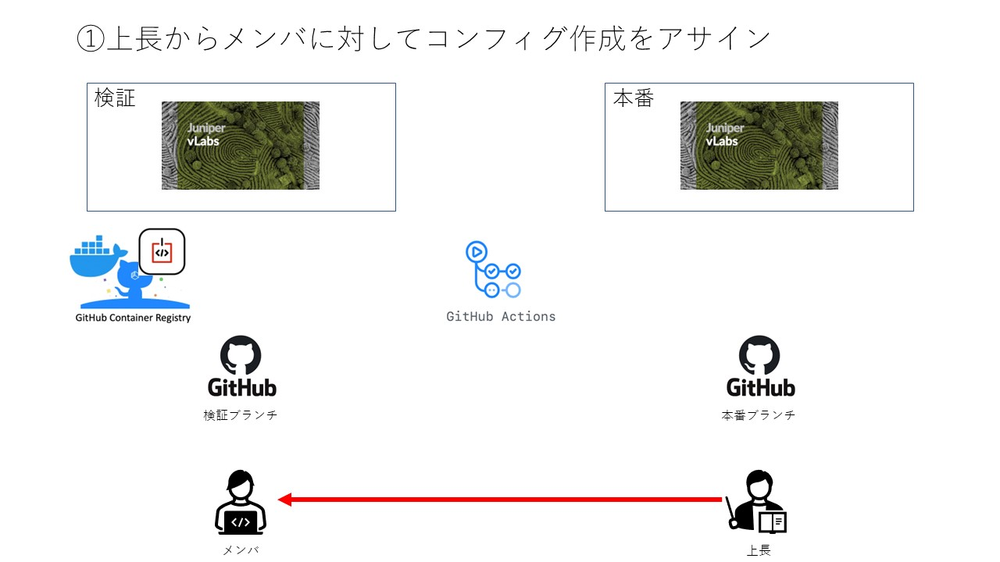</kbd>

<kbd>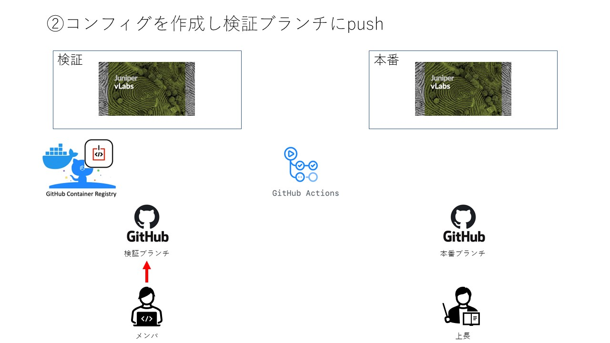</kbd>

<kbd>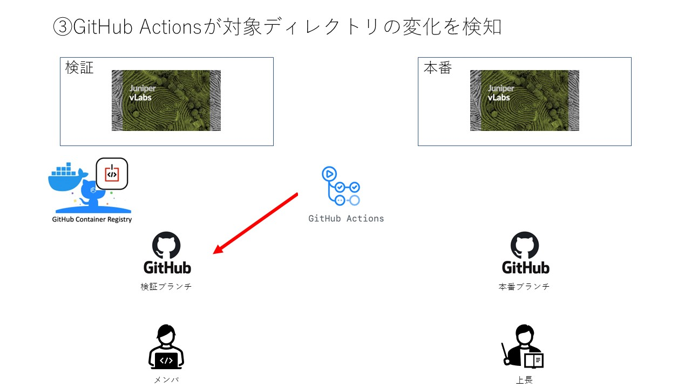</kbd>

<kbd>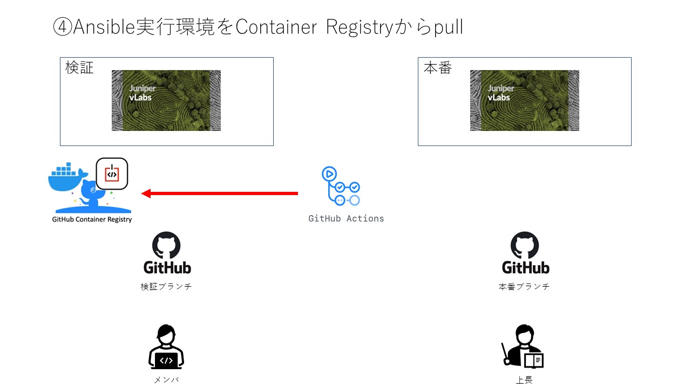</kbd>

<kbd>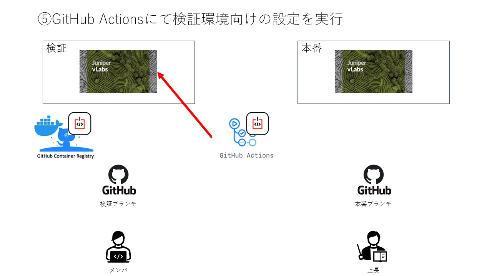</kbd>

<kbd>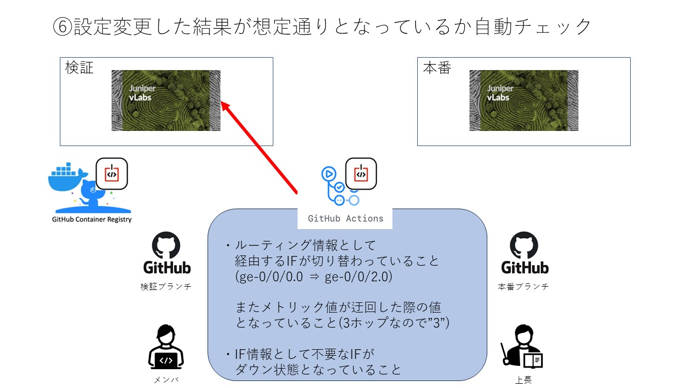</kbd>

 
 
 

## 今回のDemoで設定する内容

<kbd>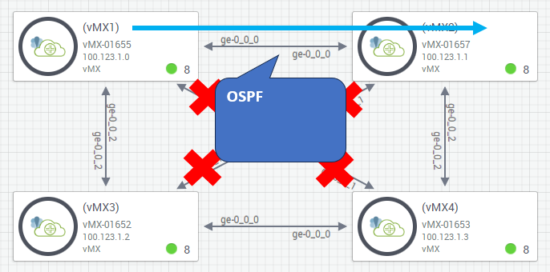</kbd>

<kbd>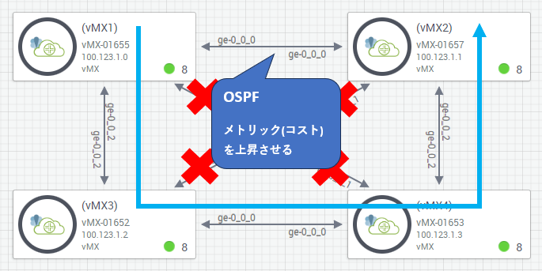</kbd>

 
 
 

## ツール実演

[GitHub_Actionsのダッシュボード](https://github.com/apc-nw-auto-cft/auto_check_config_project/actions/workflows/GA_commit_and_inspect.yaml)

 
 
 

## どのように動作しているか？

[GA_commit_and_inspect.yaml](https://github.com/apc-nw-auto-cft/auto_check_config_project/blob/develop/.github/workflows/GA_commit_and_inspect.yaml)

 
 
 

## [工夫した点]

* 各ツールについて無料枠を利用しているため、気軽に試すことが出来る

* lintを用いてコードの可読性向上に努めました。  
  GitHub Actions関連の記述として「on」がありますが、  
  真偽値としてみなされlintに怒られたのは意外な発見でした。  

* GitHub Actionsの実行ごとにIPアドレスの穴開けが発生して面倒  
・Juniper vLabsについて最大/29の範囲までしか一度に穴開けできない  
・GitHub Actionsが利用するグローバルIPが3000セグメント程度存在し、全てを穴開けするのは現実的ではない  
  ⇒利用するグローバルIPが確定してからJuniper vLabsの穴開けが必要。  
  完了するまでの時間をsleepで決め打ちしていたが、  
  個人が公開しているリトライactionを用いることでテクニカルにすることができた   
  ⇒穴開けがあまりに面倒なのでVyOSやCMLへの移行について検討したい

 
 
 

## 下期の展望

<kbd>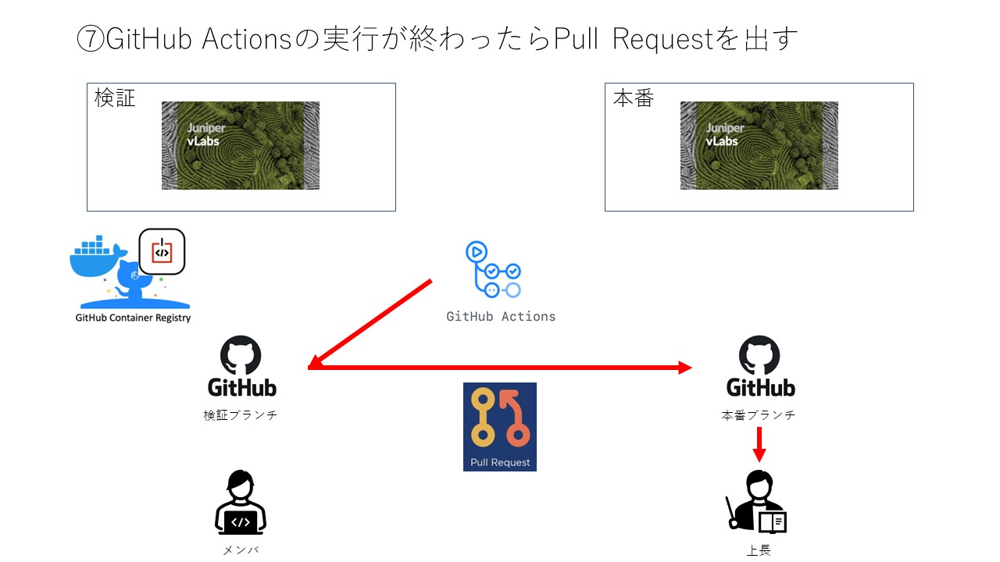</kbd>

<kbd>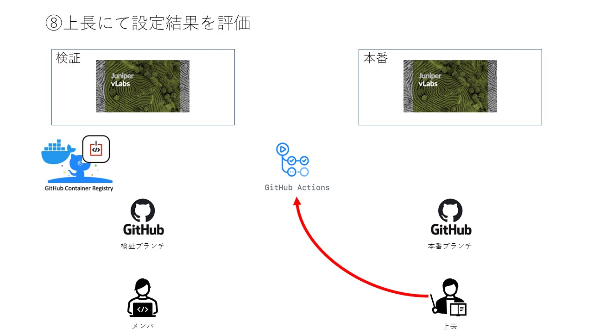</kbd>

<kbd>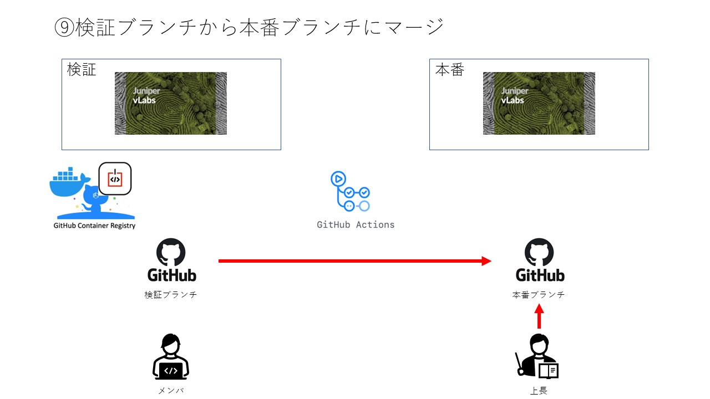</kbd>

<kbd>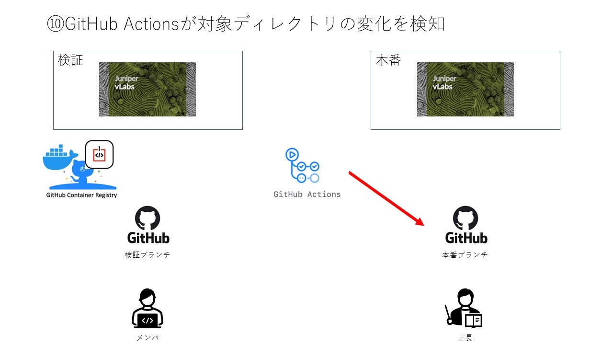</kbd>

<kbd>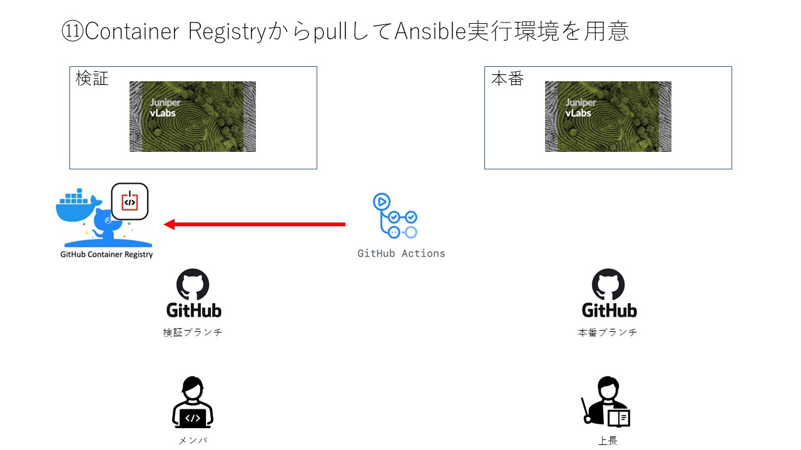</kbd>

<kbd>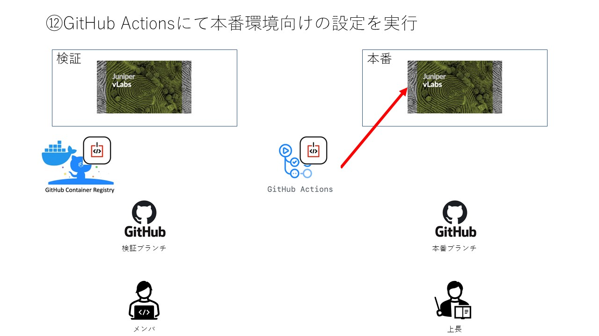</kbd>

<kbd>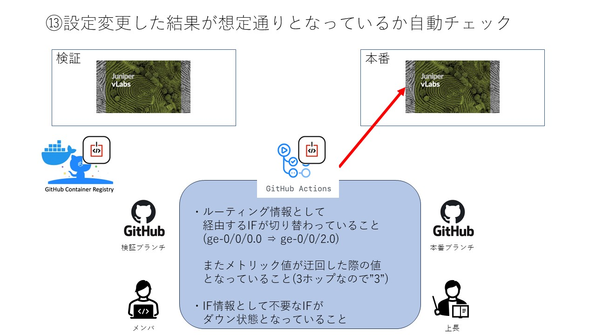</kbd>

 
 
 

## 所感

### 小野

* カイさんと北村さんとワイワイ進められて、楽しかった。  
  そして、二人ともこの数週間での成長が目覚ましく、私は嬉しいです！

* Gitlab Runnerは業務で使っているが、Github Actionsは初めて使ってみた。  
  market placeで他の人が作ったactionを拝借できるあたりに、
  community文化の強さを感じた。  
  （Gitlab.comのそれにあたる機能を私が知らないだけ？）

* 当初、jsonで取得したshowをjson_queryで堀に掘って欲しい要素を取得しようとしていたところ、  
xmlで取得したshowからxpathで直に取りに行くことにして、便利さに感動！

  * jsonにもjsonPathなるxPath的なものがあるらしいが、Ansibleでは提供されていない様子。

### 内田

* vLabs利用にあたってJuniperと面倒なやり取り  
2017年の新卒時にかじっていたものが残っていたせいで不要なサポート問い合わせが発生  
パスワード変更もダメ、チャットボットを使おうにもまずログインできてないからダメ、  
Gmailのエイリアスで新アドレスを利用しようとしてもダメ、   
結局英語のメールで5ラリーくらいしてようやく解消しました。。  

* 小野さんのバイタリティに脱帽  
初めて同じグループで活動させていただいたのですが、  
日中にマネージャ業務＆育児してるのがビックリなくらい、  
シラフ/非シラフいずれも業後のグループ活動でめっちゃ元気でした笑

### 北村

* CICDの関連技術について予備知識がなかったが基礎レベルまで学ぶことが出来た  
(poetry、docker、ansible-builder、ansible-navigator)

* Gitについて共同開発で利用したことが無かったため、pull漏れやコンフリクトが起きた時の対処等勉強になった

* (最終的に利用していませんが)Juniperのshowコマンドから"json形式"で必要な情報を抜き出すのが大変でした。

* まだちゃんと理解できていない部分もあるので、マニュアル作成を行うなど下期までに理解を深めたい

* 発表資料についてマークダウンで作成してみました。  
川名さんが利用していたMarpについて気になるので下期は検討できればと思っています。

 
 
 

## 質疑応答

### (質問が来なくて悲しくならないための)想定質問

* クイックスタートについてどのくらい簡単にできるのか見てみたい

* GitHub Actionsの「on」がlintに引っかかった件はどうやって解消した？

* docker起動時に必要なアプリケーションがインストールされるってどういうこと？

* 作成したコードについて更に深堀してみる？

* なぜ対象機器としてJuniperを選択したのか？
