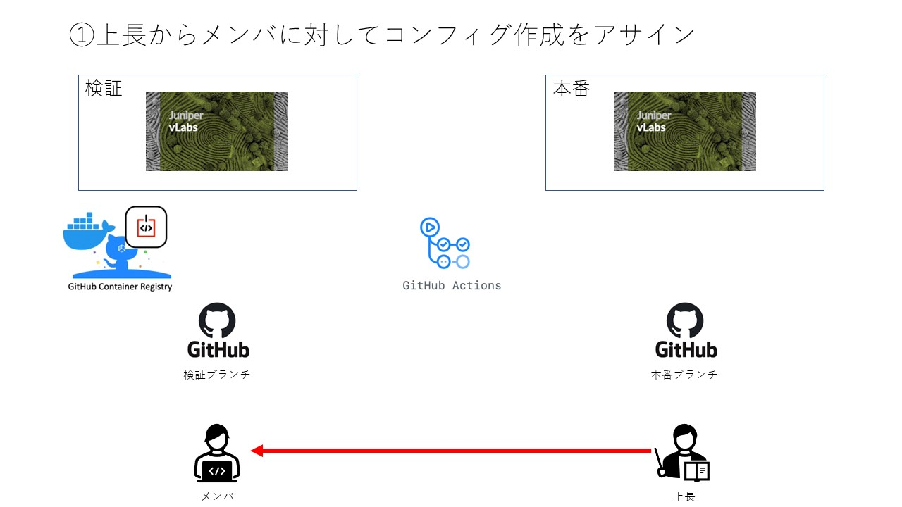
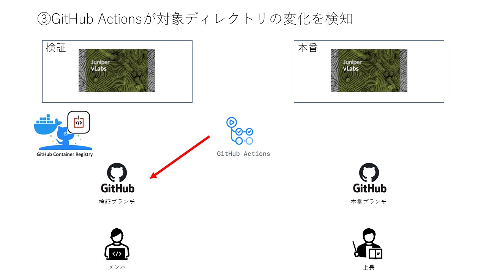
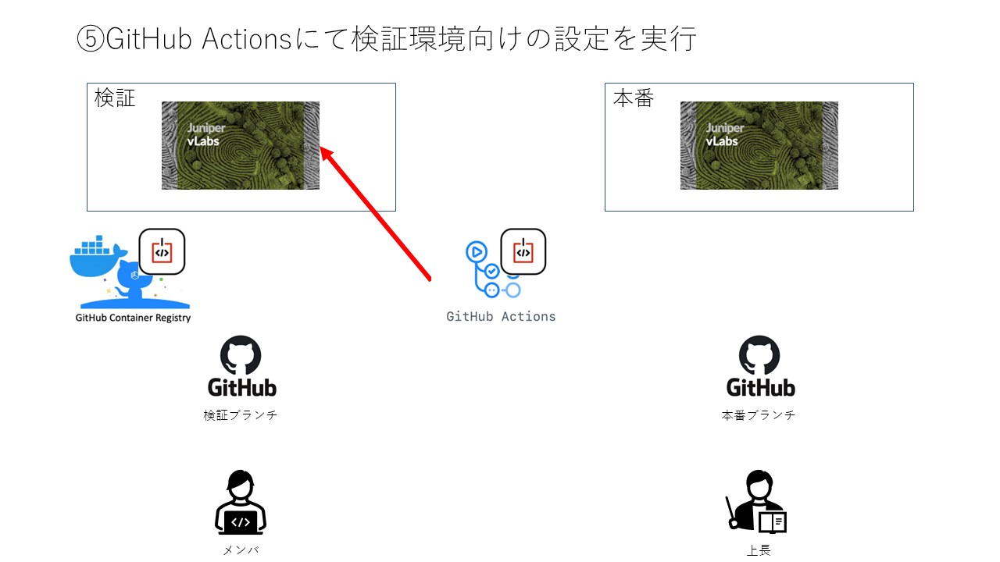
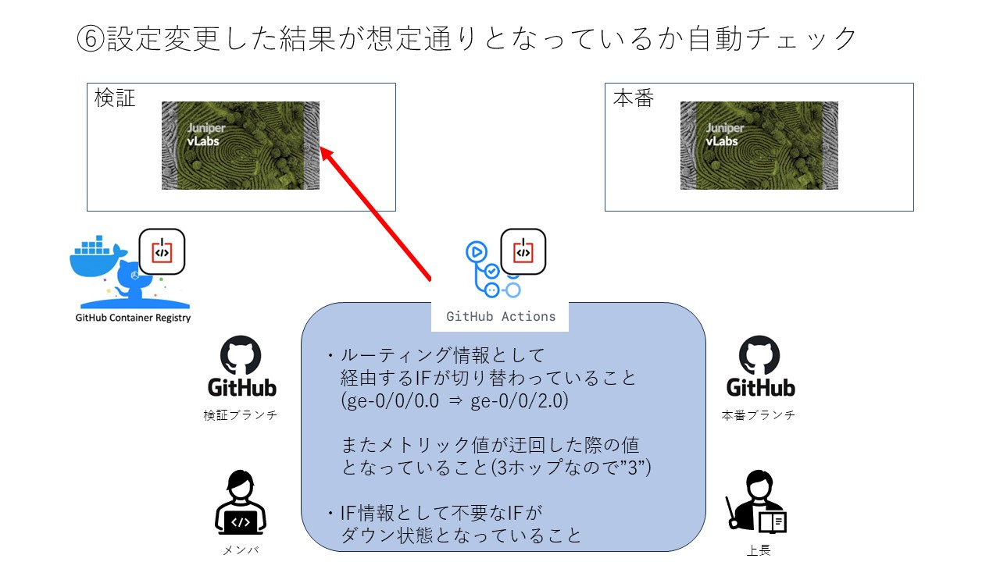

# configCICD Group 下期成果発表 2023/11/30

## アジェンダ

* 参加メンバ紹介

* 上期の振り返り

* 下期でやりたかったこと

* 今回のDemoで設定する内容

* ツール実演

* 工夫した点

* 大変だったこと

* 来期の展望

* 所感

* 質疑応答

 
 
 

## 参加メンバ紹介

### 小野

* MBS ATNW、DOOP所属
* 2日後に41歳になります。(拍手してください)

### 内田

* BzD ACT所属
* GAS(Google Apps Script)を触りだしたら性格が悪くなった
* 最近まで職質されそうな風貌してました

### 北村

* MBS FIG所属
* 2023/10からFIGに異動したばかり
* 運用保守→検証で自動化は未経験

### 佐藤

* MBS RCOA所属
* NW運用監視→NW自動化という変態キャリア
* 自動化は勿論、周辺知識もまだまだなので日々悪戦苦闘してます

 
 
 

## 上期の振り返り

<kbd></kbd>

<kbd></kbd>

<kbd></kbd>

<kbd></kbd>

<kbd></kbd>

<kbd></kbd>

 
 
 

## 下期でやりたかったこと

* 検証環境と本番環境の分離  
メンバの人が気兼ねなく設計できるように本番環境と同等の検証環境を作成したい

* PullRequestの作成  
本番環境でのCI/CD実行について別途pushするのは面倒なので、  
上長のマージが完了したら自動的に実行されてほしい

* コンフィグ世代管理  
投入コンフィグだけではなく実機のコンフィグについても、  
Githubで管理しNW機器のコンフィグを包括的に管理できるようにしたい

* (Juniper vLabsではなくモダンなツールに移行したい(笑))  
Juniper vLabsのACLがGithub Actionsと相性が悪いので、
もっとイケてるツールに移行したい

<kbd></kbd>

<kbd></kbd>

<kbd></kbd>

<kbd></kbd>

<kbd></kbd>

<kbd></kbd>

<kbd></kbd>

 
 
 

## 今回のDemoで設定する内容

<kbd></kbd>

 
 
 

## ツール実演

### コミットメッセージ例
* 渚のベートーベンズ
* 街にヤバい奴らが増えた

 
 
 

## 工夫した点

* 環境2面化  
  実行されているブランチに応じて参照するインベントリファイルを分岐し、  
  単一のタスクで複数環境を操作できるようにした。  

  またdevelop環境の場合でのみ実施したい処理について  
  if文を用いることでproduction環境でスキップできるようにした。

* PullRequest周り  
  Github Actionsが実行されるきっかけとなったコミットメッセージを取得し、  
  PullRequestのタイトル部に引用することでpush理由を分かりやすくしました。  

  またPullRequestが生成されるきっかけとなったGithub ActionsのURLを取得し、  
  PullRequestの本文に記載することで依存関係を分かりやすくしました。

* コンフィグ世代管理  
  当初は投入するコンフィグのみを管理していたが  
  Github Actionsに別途バックアップ処理を追加することで、  
  現行コンフィグについても併せて管理できるようになった。

* containerlab周り  
上期の課題としてあった、Github Actionsで払い出されるIPを都度穴あけする必要があったのですが、  
conttainerlabに移行してEC2に一度に穴あけすることでそのタスクから解放されました。  
(同時にIPを穴あけする時間を稼ぐための処理も省くことができたのでGithub Actionsの実行も早くなりました)

### Blog書いたのでよかったら見てください⇒ [【Blog Week】containerlabを使ってみた](https://techblog.ap-com.co.jp/entry/2023/10/26/203441)

 
 
 

## 大変だったこと

* 環境2面化  
  工夫した点で挙げた要素の"構造化"的な思考が難しかった。  
  また他の要素にも通じるがLinuxの環境変数(${})と、yamlの変数("{{}}")が混在していて面倒だった。

* PullRequest周り  
  Github Actionsをいちユーザとして捉えられていなかったため、  
  権限やトークンを持たせるイメージが付かず、  
  ワークフローがコケた原因を掴めず苦慮した。。  

* コンフィグ世代管理  
  Github Actionsをいちユーザとして捉えられていなかったため、  
  Gitの初期設定(name、email)をするイメージが付かず、  
  ワークフローがコケた原因を掴めず苦慮した。。

* containerlabに移行  
containerlabの情報が少なかったため情報を探すのが大変だった。  
機器の立ち上げの際に、startup-configをうまく読み込めないことが何度かあった。

* AWSのSecurity Ruleの上限  
  大変だったというかいまだに解決できていない点として、AWSのSecurity Ruleが甘いという問題がある。  
  Github Actionsが予約しているGlobal IPの数が3200 networkあるのに対して、  
  AWSのSecurity Ruleは1 network interfaceにつき300しか作れない(60rule/group * 5group)。  
  そのため、だいぶアグリゲートしたprefixで穴あけせざるを得ない。

 
 
 

## 来期の展望

### 開発方面

- moleculeとか入れられないかな？
- GithubからMBSのESXiに立てているGitLab + Gitlab Runnerへの移行の検討
- 主機能のrepoとConfig世代管理のrepoは分けたい
- 昨年のSmartCS Groupの成果を取り込んで、障害試験にも活用したい
- SaaS経由でSSHさせるにはsecurityの問題は付きまといそうなので、  
  動的にFW穴あけを行う仕組みやport knockingなども検討したい。

### 展開

- APCのサービスだったりメニューに昇華できないか
- FIGのようなSI案件での活用方法も模索したい
- 各ツールについてナレッジをまとめ、NW自動化横串T内の他グループに横展開したい
  - 特にcontainerlabは需要ありそう

### その他、夢とか

- NetDevops(NetOps)とかいうbuzz wordに乗っかりたい
- GithubのProjectsを使用してタスクの見える化をする

 
 
 

## 所感

### 内田

* (最近寒くて喉・鼻が痛い)
* (小野家に通い詰めていたら娘さんに名前を覚えていただけました。)
* (育児の現場を目の当たりにして子供部屋おじさんは勉強し放題で恵まれてるなと実感しました。)

### 北村

* containerlabを触る良い機会になりました。
* マニュアル作成等は引き続き行なっていきたい…

### 佐藤

* 発表資料をdrawio使って書いてみました(next is marp)。
* 途中で参加したため、理解できていないところが多々。引き続きProject理解を引き続き深めていきたい
* README.mdとかdesign.mdなど整備して可読性高める&再現性のある環境にしていきたい

### 小野

* この発表だけで終わらせるのがもったいないと思っているので、各所に売り込みに行きます。よろしく！
* 下期はほとんど3人にお任せ状態でここまで進んでいた。頼もしい。
* カイさんが娘に「お父さんにxxしてねー」と言うのが、段々「お義父さん」になってきている気がして怖い。

 
 
 
