<!--
class: title
-->

# NW機器のconfigをCI/CDツールで扱ってみた

## Date: 2023/12/20

---

<!--
class: slide
paginate: true
-->

# アジェンダ

* Group紹介
* インフラ自動化の次のフェーズ
* この営みで重要なポイント
* DEMO
* 今後の展望

---

<!--
class: chapter
paginate: false
-->

# Group紹介

---

<!--
class: slide
paginate: true
-->

# NW自動化横串Teamの派生Group

NW自動化横串Teamでは自分たちで好きな課題を立て、Groupに分かれて活動し成果を挙げるスタイルで活動しています。  
私たちは「NW機器のconfigをCI/CDツールで扱ってみた」というテーマで、横串Tの中で集まりました。  
メンバーは加入順に  

* 小野志峰
* 内田開偉
* 北村晃司朗
* 佐藤丞

の4人です。

本日はそこから私、小野志峰が説明します。

---

<!--
class: chapter
paginate: false
-->

# インフラ自動化の次のフェーズ

---

<!--
class: slide
paginate: true
-->

# RedHatが提唱するインフラ自動化の次のフェーズ

Red Hat Ansible Automates 2023 Japanでは、  
「インフラ自動化の次のフェーズは"コミュニケーションに注目した効率化"」と語られていました。
https://tracks.redhat.com/aa2023jpn/01_2023-07-20_automa?lx=tGsQE7  

これまでの自動化は「作業」に使うリソース(時間)を削減してくれるツールでしたが、  
これからの自動化は「コミュニケーション」に使うリソース(時間)の削減を目指すようになっていきます。

---

# 自動化以前

例えばACLの穴あけ業務をイメージしてください。  
自動化以前はやってくる申請に基づき、人がconfigを作成し、
機器にTerminalから手動で流し込んでいました。  
そして完了すれば作業結果(レポート)を提出します。  

  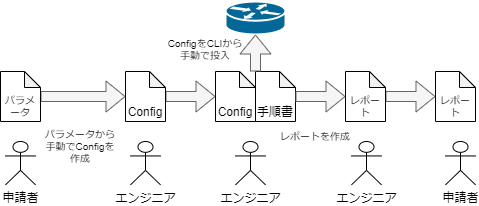

---

# 作業の自動化

このような作業を自動化した場合、作業者は「パラメータの作成」と  
「config流し込みツールの実行」、  
そして「出力されるレポートの送信」だけを担うようになりました。

configの作成、流し込み、レポート起案はツールが自動でやってくれるのです。  
*これが「作業の自動化」です。*  

  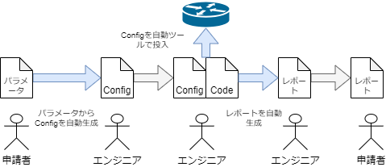

---

# コミュニケーションを省力化した自動化

2023年現在は申請者がUIに従いパラメータを入力し、  
ボタンを押せばAPI経由で先述のツール群が手続き的に自動実行される、  
という仕組みが簡単に実装可能になりました。  
作業者を介する必要がなくなり、コミュニケーションに使うリソース(時間)が格段に削減されました。

  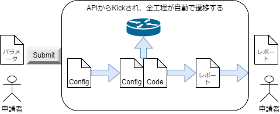

---

# 我々が着目したのはConfig検証とレビューの効率化

プロジェクトによっては申請ごとにConfigの検証とレビューを行うこともあります。  
ここにもたくさんのコミュニケーションコストがかかっていることが想像できます。  

## なぜそんなにNWの変更に慎重になるのか

これは少し古い記事ですが、Ciscoの技術者はNetDevOpsを迎え入れる必要性を説く際に、  
"Culture of Fear"という言葉を使っています。  
https://blogs.cisco.com/developer/embrace-netdevops-part-1

>組織内のネットワーキングの文化とアプローチは、恐怖と不信のループを強化し、ネットワーキング チームが今日の「デジタル ビジネス」に必要な俊敏性を提供できなくなる原因となっています。

---

# けど、現代においてはそうもいってられない

慎重なことは決して非難されるべきではありませんが、  
ビジネスがどんどん加速している状況でNWを「迅速に」「柔軟に」変更できないことは問題です。  
このような文脈からNetDevOpsの思想は登場しました。
もう一度先程の文献を引用します。

>「NetDevOps」を実践している組織は、ネットワークの変更が日常的であり、予想されるものであると考えています。<中略> ネットワークの変更は日常的なものであるため、ネットワークの変更を設計、テスト、展開するためのプロセスが明確に定義され、実践されています。

我々は今回、NetDevOpsの一環としてGithub Actionsを使用して、  
Configの検証とレビューを安全かつ効率的に行う方法に挑戦しました。

---

# ちょっとかっこつけすぎました

上記は後付けのもっともらしい理由で、
今回取り組むにあたってのきっかけはなんか楽しそうだからやってみました！

---

<!--
class: chapter
paginate: false
-->

# この営みで重要なポイント

---

<!--
class: slide
paginate: true
-->

# この営みで重要なポイント1

私たちが今回紹介する方法では、以下が重要なポイントです。

## 投入config - 合格基準 - 検証結果はversion管理され、1対1となる

git pushすることで検証が開始されるため、  
投入configや合格基準を当然versionが管理されます。そして、検証結果もversionに紐づきます。  
つまり、検証でしばしば起こる「この結果はどのconfigのときのもの？」という辛い現象が起こらなくなります。

---

# この営みで重要なポイント2

## 合格基準を満たして初めてレビューと承認が可能になる

合格基準を満たして初めてGithub上でpull requestが発行されます。  
合格基準を満たすまでは差し止められ、pull requestが発行されないため、当然レビューも開始されません。

---

# この営みで重要なポイント3

## Config検証における合格基準は全てcodeで定義されている

定性的な「XXができていること」のような基準ではなく、  
状態をjsonで取得し、queryした結果が想定と合致しているかを検査します。  

つまり、設定された条件で要件を満たすことと、条件自体に誤りがないことを  
codeを通して評価することがレビューとなるため、レビューはより厳格になります。

---

# この営みで重要なポイント4

## レビューのトレーサビリティが向上します

pull requestをレビュアーがmergeすることをもってconfigの承認となります。  
どの検証結果をもってconfigが承認されたかが明確になるため、トレーサビリティが向上します。

---

# この営みで重要なポイント5

## 検証と同じ方法で本番に投入できます

configが自動で投入される仕組みは検証環境でも本番環境でも同一であるので、検証結果が真正に反映されます。

---

<!--
class: chapter
paginate: false
-->

# DEMO

---

<!--
class:
paginate: true
-->

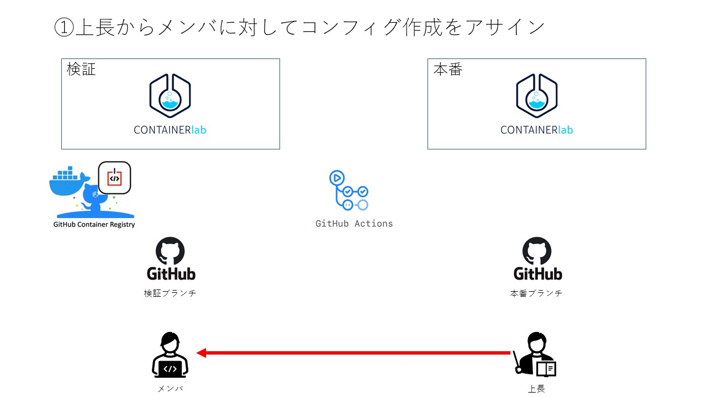

---

<!--
class:
paginate: true
-->

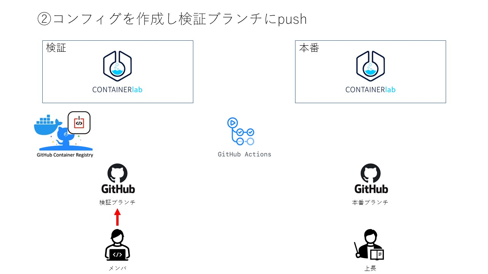

---

<!--
class:
paginate: true
-->

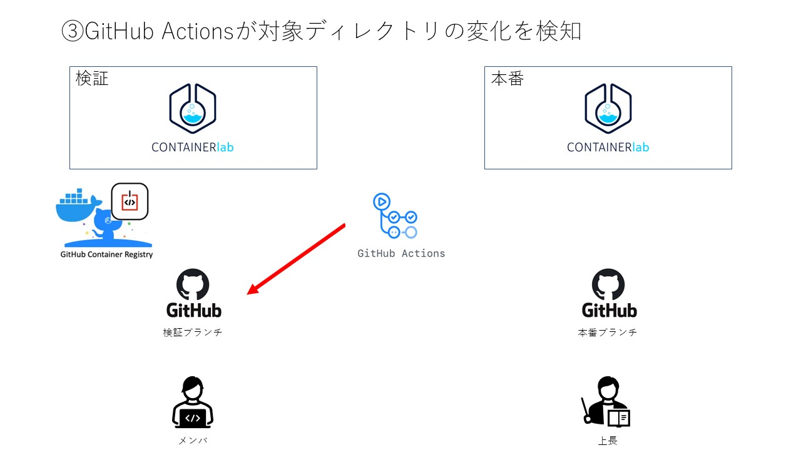

---

<!--
class:
paginate: true
-->

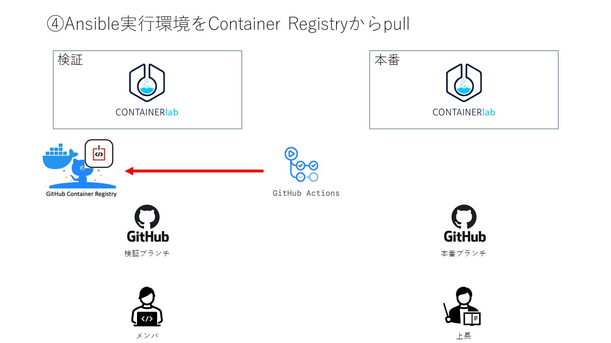

---

<!--
class:
paginate: true
-->

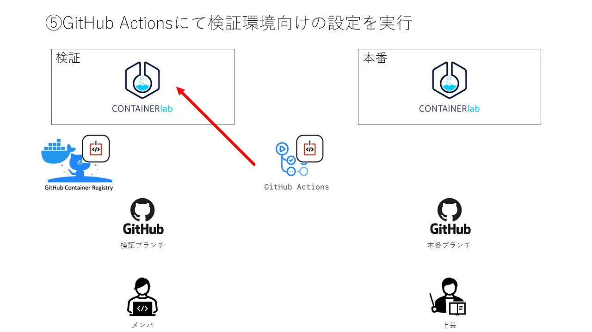

---

<!--
class:
paginate: true
-->

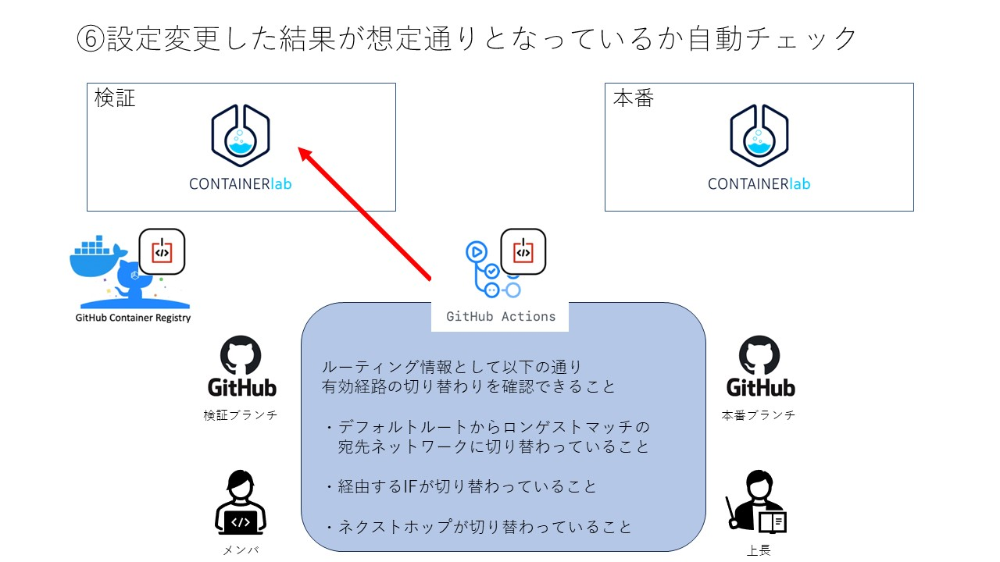

---

<!--
class:
paginate: true
-->

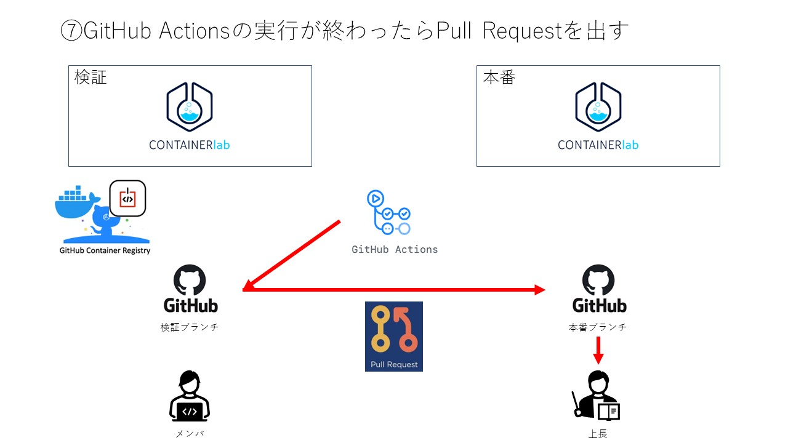

---

<!--
class:
paginate: true
-->

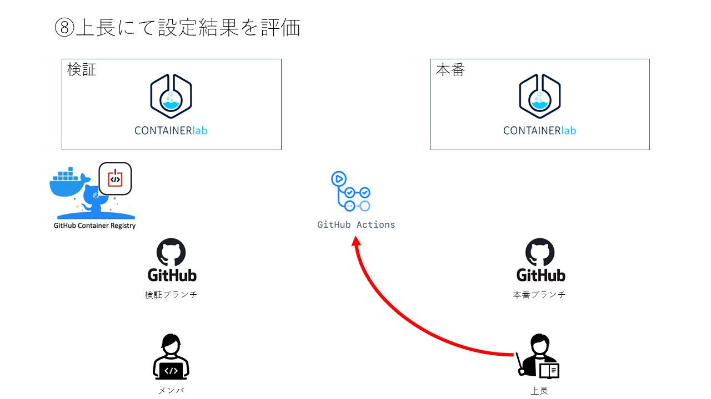

---

<!--
class:
paginate: true
-->

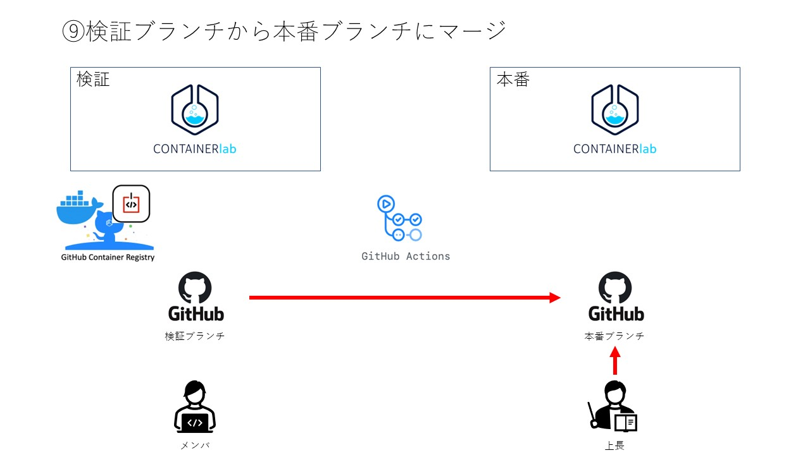

---

<!--
class:
paginate: true
-->

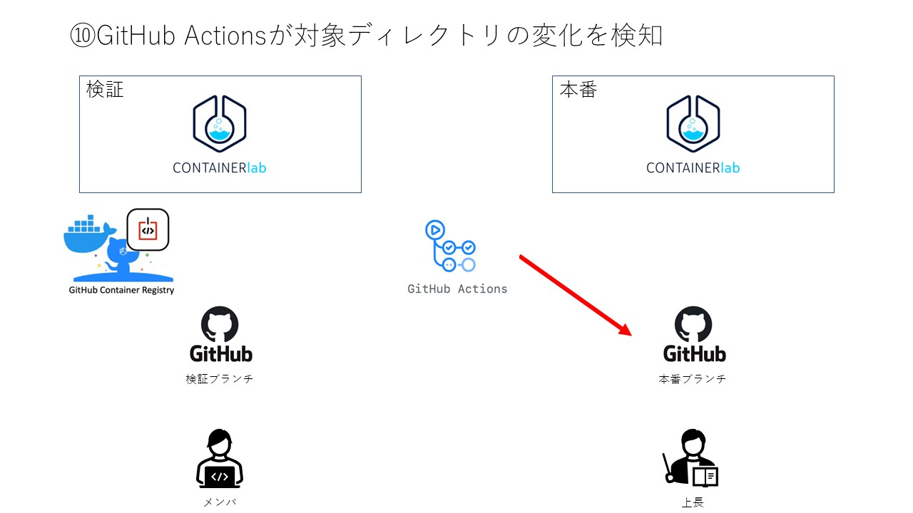

---

<!--
class:
paginate: true
-->

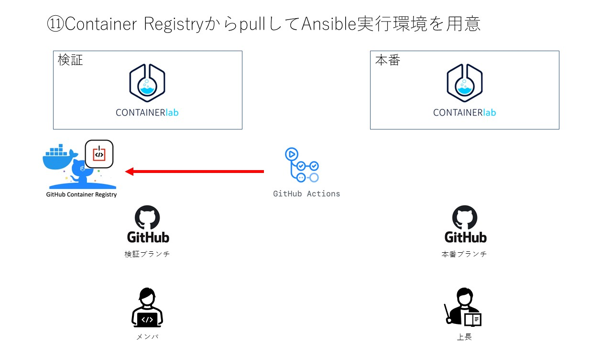

---

<!--
class:
paginate: true
-->

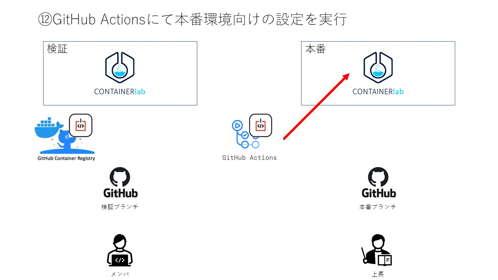

---

<!--
class:
paginate: true
-->

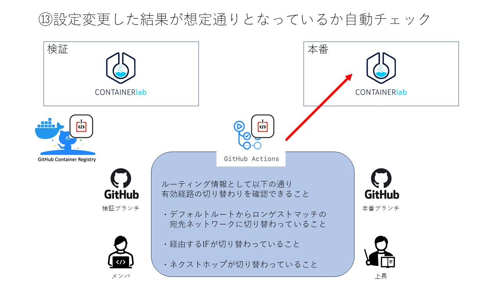

---

<!--
class: chapter
paginate: true
-->

# 今後の展望

---

<!--
class: slide
paginate: true
-->

# 今後の展望

* iTOC事業部MBS部に来期新設する"NetDevOps"PJの推しサービスに昇華したい
* GitLab + Gitlab Runnerでも同様の機能を実装し
オンプレミスのみ導入可能な現場の需要も掴みたい
* 主機能のrepoとConfig世代管理のrepoは分ける
* SI方面での活用方法を模索

---

<!--
class: backcover
paginate: true
-->
